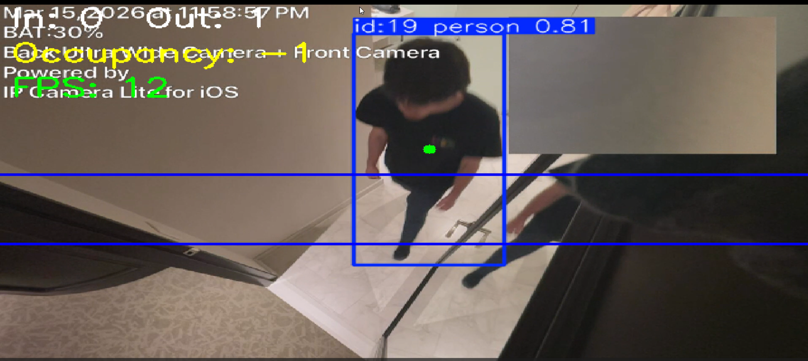

# Sentinel — Self-Hosted AI Camera Intelligence

> A privacy-first, multi-camera AI security system — built end-to-end from **repurposed phones and tablets**. It detects people and vehicles, records on motion, and counts occupancy with pose-based tripwires. Everything runs locally; no cloud, no subscription, no data leaving the property.



---

## Why this project

Most "smart cameras" send your footage to someone else's servers. Sentinel is the opposite: a complete surveillance stack assembled from **old phones and tablets that would otherwise be e-waste**, feeding a GPU-accelerated computer-vision pipeline that runs entirely on a single machine. It's a real, deployed system — four cameras live on an actual property — not a notebook demo.

It's also a study in *systems* engineering: weak Wi-Fi, flaky consumer-phone camera apps, GPU pipelines, multi-camera tracking, and the unglamorous networking failures that decide whether a 24/7 system actually stays up. Those battles are documented in [`docs/DEVLOG.md`](docs/DEVLOG.md).

---

## Architecture

```
 Old phones / tablets ──(MJPEG / HTTP-FLV over Wi-Fi)──┐
                                                        ▼
                                          go2rtc  ── restream hub ──
                                       (one stable connection per camera)
                          ┌─────────────────────────┴─────────────────────────┐
                          ▼                                                     ▼
                    Frigate NVR                                        Sentinel  (CV brain)
        person / car detection · motion recording           YOLOv8-Pose → per-camera ByteTrack
                snapshots · live web UI                      → confidence voting → tripwire FSM
                          │                                                     │
                          ▼                                                     ▼
                 Live multi-camera viewer                          SQLite event log + dashboard
```

Both consumers read from **go2rtc** (the restream hub), so each phone is connected to exactly once — which is what keeps weak/old devices from being overwhelmed.

---

## Repository layout

```
Sentinel/
├── sentinel/        # The CV brain — modular, GPU-accelerated, multi-camera pipeline
│   ├── config.py    #   cameras + thresholds + tripwire geometry (dataclass-driven)
│   ├── capture.py   #   threaded latest-frame grabber w/ reconnect + staleness watchdog
│   ├── detector.py  #   one shared YOLOv8-Pose model, batched GPU inference
│   ├── tracker.py   #   one ByteTracker per camera (no cross-stream ID bleed)
│   ├── motion.py    #   Frigate-style motion gate (skip inference on empty scenes)
│   ├── counter.py   #   TripwireCounter FSM + TrackScorer (confidence voting)
│   ├── storage.py   #   WAL SQLite via a single writer thread (no lock contention)
│   ├── events.py    #   pre/post-roll clip buffer + best-frame snapshot
│   └── app.py       #   orchestrator
├── nvr/             # Frigate NVR setup (docker-compose + sanitized config.example.yml)
├── viewer/          # Retro multi-camera live dashboard (HTML/JS, mpegts.js)
├── docs/            # DEVLOG · STREAMING · HARDWARE · RESEARCH · TUNING
├── dashboard.py     # Streamlit occupancy analytics dashboard
└── REFACTOR_PLAN.md # The in-depth engineering plan behind the rebuild
```

---

## Status

**✅ Built & running**
- **NVR:** Frigate live on **4 cameras** (2 Android tablets + 2 iPhones, all repurposed), person + car detection, motion recording, snapshots.
- **Restream hub:** go2rtc front-ends every camera so each device is hit once — solving the "ghost-client" overload that plagues pull-based setups.
- **Live viewer:** a retro multi-camera web dashboard.
- **Sentinel brain (rebuild):** the single-file CPU prototype has been refactored into a modular, GPU-batched, multi-camera pipeline — per-camera tracking, a debounced tripwire state machine, confidence voting, and crash-resistant capture/storage. See [`REFACTOR_PLAN.md`](REFACTOR_PLAN.md).

**🚧 In progress**
- Wiring the Sentinel brain onto the live 4-camera Frigate restreams + on-device GPU benchmarking.

**🔮 Roadmap**
- **Cross-camera re-identification** — follow the *same* person across all cameras (appearance embeddings) → a global identity that powers everything below.
- **Unique-person occupancy + movement map** — "who is where on the property," with paths/heatmaps via ground-plane homography.
- **LLM insight layer** — turn the structured event log into plain-English daily briefings + anomaly flags.
- **RF sensing fusion (future)** — mmWave / Wi-Fi-CSI sensors to see *where cameras can't*, fused into one occupancy map. See [`docs/RESEARCH.md`](docs/RESEARCH.md).

---

## How the occupancy counting works

A virtual tripwire is drawn across the frame. Instead of tracking the bounding-box center (which jumps under occlusion), Sentinel tracks the **shoulder midpoint** from the pose keypoints:

- starts on one side → crosses to the other → counted as an **entry** or **exit**.

The rebuild hardened this with three Frigate-inspired techniques:
- **Confidence voting** — a track must be confidently detected across several frames before it can count (kills one-frame false positives).
- **Debounced crossing FSM** — requires K consecutive frames on the new side, and resets after a crossing so the same person can cross again (fixes double-counts and the "counted-forever" lock).
- **Motion gating** — skips GPU inference on empty scenes.

---

## Engineering highlights

Real deployment surfaced real problems — all documented with root-cause analysis in [`docs/`](docs/):

- **The "ghost-client" pileup** — Frigate *pulling* from a flaky phone leaves dozens of half-open TCP connections that strangle the device's tiny server. Diagnosed down to the exact `FinWait2`/`CLOSE_WAIT` socket states; fixed structurally by switching to a push/restream model. ([DEVLOG](docs/DEVLOG.md))
- **Stream format beats every tuning knob** — H.264 (hardware-encoded, plays native) vs MJPEG (heavy, must transcode) was the single biggest factor in frame rate on old hardware. ([TUNING](docs/TUNING.md))
- **Reliability over weak Wi-Fi** — push (SRT) vs pull, restream hubs, and the hardware path to purpose-built PoE cameras. ([STREAMING](docs/STREAMING.md) · [HARDWARE](docs/HARDWARE.md))
- **GPU pipeline** — one shared YOLOv8-Pose model, batched inference across cameras, per-camera trackers, on a 4 GB GTX 1650.

---

## Running it

> The real camera config (with LAN IPs), recorded footage, and databases are **gitignored** — only sanitized examples are committed.

**NVR (Frigate):**
```bash
cd nvr
cp config/config.example.yml config/config.yml   # fill in your own camera URLs
docker compose up -d                              # UI at http://localhost:5000
```

**Sentinel brain:**
```bash
pip install ultralytics opencv-python streamlit pandas openvino
# CUDA build of torch for GPU (optional): see REFACTOR_PLAN.md
python -m sentinel                # run the multi-camera pipeline
streamlit run dashboard.py        # occupancy analytics dashboard
```

---

## Tech stack

| Layer | Tools |
|---|---|
| Detection & pose | [Ultralytics YOLOv8-Pose](https://github.com/ultralytics/ultralytics) |
| Multi-object tracking | ByteTrack (per camera) |
| Acceleration | CUDA (GTX 1650) · Intel OpenVINO |
| NVR | [Frigate](https://frigate.video) + go2rtc + Docker/WSL2 |
| Capture / vision | OpenCV · FFmpeg |
| Storage & dashboard | SQLite (WAL) · Streamlit · Pandas |
| Live viewer | HTML/JS · mpegts.js |

---

*Built and deployed on real hardware. A working system, not a demo — and an ongoing one.*
